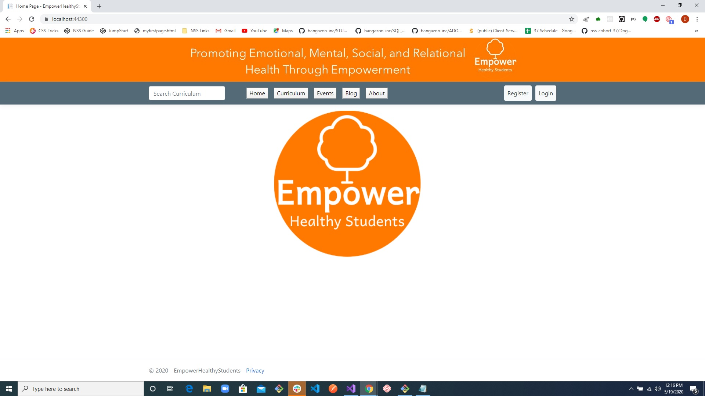
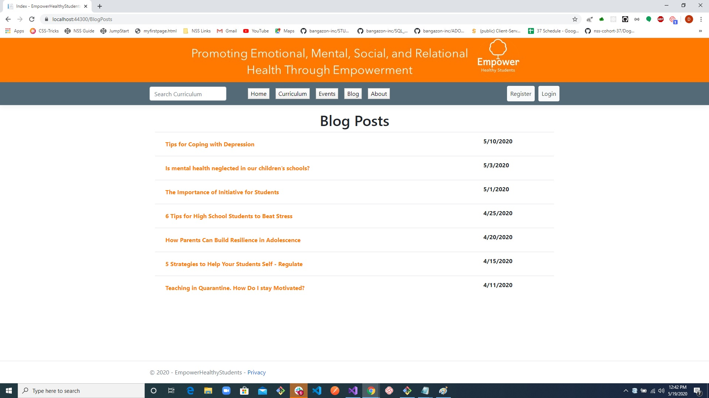
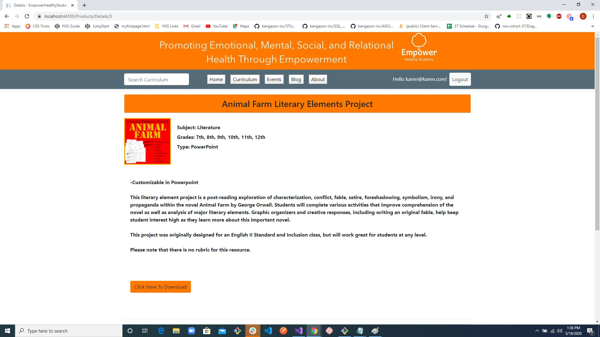

# EmpowerHealthyStudents-Capstone

Empower Healthy Students is a brochure site created with ASP.NETCore MVC utiitizing Entity and Identity framework that allows 
the user to upload and create content to share with other users. 

The purpose of this app is for teacher friend to upload blogs and curriculum that may be used by other teachers, social workers, and 
counselors to help students heal and grow emotionally, mentally, socially, and relationally.

## Installation

From your terminal run git clone SSH KEY

Open Visual Studio, go to tools tab, open NuGet Package Manager console, and enter Add-Migration. 

It will then prompt you to give the migration a name. Call it Initial(or whatever you want to call it). 

After it is done running enter Update-Database. 

## Usage

1. Admin can login (See ApplicationDBContext for Admin login name and password). 
2. Admin can create, edit, delete Blog Post. 
3. Admin can create, edit, delete Event. 
4. Admin can create, edit, delete curriculum. 
5. Admin can create, edit, delete comment.
6. Admin can delete other users comment.
7. Admin can create, edit, delete curriculum review.
8. Admin can delete other users curriculum review. 
9. Admin can upload image and document. Go to create (or edit). Click on upload button. Choose file/image from desktop or image/file folder. 
10. User can login. (there are three user accounts
11. User can create, edit, delete blog comment. 
12. User can create, edit, delete curriculum review. 
13. User can download curriculum. User needs to login. Go to curriculum detail page. Click on download link. 
14. User and Admin can search for curriculum by name, subject, and/or grade. 
